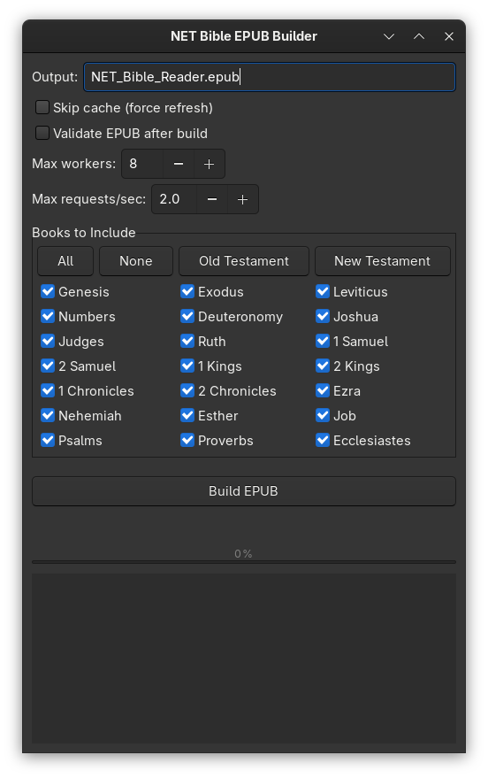

# NET Bible (2nd Edition) Builder 📖🐍



A Python tool that procedurally generates a "Gold Master" EPUB of the NET Bible (2nd Edition) using the `labs.bible.org` API.

**Why build your own?**
Most free Bible downloads are cluttered with footnotes or possess poor navigation. This tool builds a "Reader's Version" designed for deep reading:
* **Clean Spine:** The ebook menu lists only the 66 Books (not 1,189 chapters).
* **Grid Navigation:** Every book starts with a "Chapter Grid" for instant jumping.
* **Smart Links:** Context-aware "Next/Prev" buttons and a "Back to Chapters" center button.
* **Offline Forever:** Once built, the file is yours. No internet required.

## Features

* **GUI and CLI:** Run with a native GTK interface or from the command line.
* **Customizable Builds:** Select which books to include, with presets for Old and New Testaments.
* **Parallel Fetching:** Scrapes all chapters using multi-threading for speed.
* **Smart Caching:** Saves raw HTML locally; if a build is interrupted, you don't have to re-download.
* **Modern UX:** Includes a "Chapter Grid" at the start of every book for fast navigation.
* **Validation:** Optional EPUB validation using `epubcheck`.

## Installation

1.  **Clone the repository:**
```bash
git clone https://github.com/cardgamepenguin/net-bible-builder.git
cd net-bible-builder
```

2.  **Install dependencies:**
    It is recommended to use a virtual environment.
```bash
python -m venv venv
source venv/bin/activate  # On Windows, use `venv\Scripts\activate`
pip install -r requirements.txt
```
    > **Note for Linux users:** The GUI requires GTK. You may need to install it via your package manager (e.g., `sudo dnf install gtk3-devel` on Fedora or `sudo apt-get install libgtk-3-dev` on Debian).

## Usage

### 🖥️ Graphical Interface (GUI)
For the easiest experience, run the app:
```bash
python gui_gtk.py
```
* **Select Books:** Check/uncheck specific books or use presets (OT, NT).
* **Visual Progress:** Watch the build happen in real-time.
* **Settings:** Toggle "Skip Cache" or adjust worker threads directly.

### 💻 Command Line (CLI)
For power users or automation, use `cli.py`:

**Build the full Bible:**
```bash
python cli.py
```

**Build specific sections:**
```bash
# Build only the New Testament
python cli.py --only-nt

# Build only specific books
python cli.py --books "John,Romans,Revelation"

# Force a fresh download (ignore cache)
python cli.py --force-refresh
```

## Credits & License
* **Text:** The NET Bible® (2nd Edition). Copyright © 1996–2019 by Biblical Studies Press, L.L.C. All rights reserved. Used via open API.
* **Code:** GPLv3 License. Created using AI pair programming (Google Gemini).

**Disclaimer:** This tool is for personal and ministry use. The generated files should not be sold or distributed commercially.
